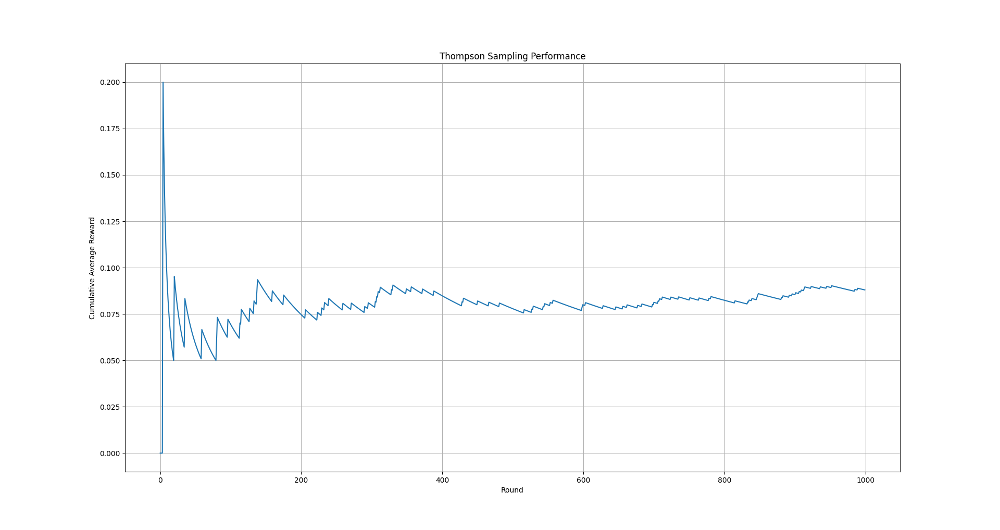

# qubit-note: Thompson Sampling


## Overview

Very often we are presented with a number of choices that we need to select one in order
to proceed. Typically, we want to select the choice that somehow improves by either maximizing or minimizing
a certain criterion. There are many approaches one can utilize in order to make such a section.
In this note, I discuss one of them namely <a href="https://en.wikipedia.org/wiki/Thompson_sampling">Thompson sampling</a>.

**keywords** Thompson-sampling, exploration-exploitation, MAB, decision-making


## Thompson sampling

<a href="https://en.wikipedia.org/wiki/Thompson_sampling">Thompson sampling</a> is a sampling methodology that is frequently used
when dealing with multi-armed bandit, or MAB, problems. These are problems where we have a number of actions/choices
that seemingly perform the same and we need to choose one of them. Such problems include online advertisement placement,
cold email selection e.t.c. The issue with MAB type of problems is that each choice poses as a good action
but this need not be the case. If we are able to estimate the rewrd distribution behind each choice then we will be able
to make educated guesses at least probabilistically. Estiamting the reward distribution implies that we need to estimate
its parameters.


Thompson sampling is one approach we can use when working with MAB problems. Other approaches include 
upper confidence bound (UCB) and $\epsilon-$greedy. The advantage of Thompson sampling is that we don't need to 
fine tune any hyperparaneters. In addition, it has been shown to be a very competitive choice in many benchamrks
available in the literature.

Typically, we implement Thompson sampling using the <a href="https://en.wikipedia.org/wiki/Beta_distribution">beta distribution</a>
but this need not be the case. The reason behind this choice is that this distribution is used to model
the  uncertainty about the probability of success of an experiment. 
It is governed by two parameters $\alpha$ and $\beta$ that we can tune depending on whether the experiment was successful or not.
It has the following PDF

$$
f(x) = \frac{\Gamma(\alpha + \beta)}{\Gamma(\alpha)\Gamma(\beta)}x^{\alpha - 1}(1-x)^{\beta - 1}, ~~ 0<x<1
$$

where $\Gamma$ denotes the <a href="https://en.wikipedia.org/wiki/Gamma_function">gamma function</a>.
For a reward signal $R$ we can update the parameters according to

$$
\alpha \leftarrow \alpha + R, ~~ \beta \leftarrow \beta + 1 - R
$$

The following script simulates MAD using the Bernoulli distribution for modelling an arm.
I use three arms each with a different probability of success.

```
import numpy as np
import matplotlib.pyplot as plt

if __name__ == '__main__':

    # True conversion rates for each "arm"
    true_conversion_rates = [0.05, 0.03, 0.08]
    n_arms = len(true_conversion_rates)
    n_rounds = 1000

    # Track successes and failures for each arm
    successes = [0] * n_arms
    failures = [0] * n_arms
    rewards = []

    for _ in range(n_rounds):
        # Sample from Beta distribution for each arm
        sampled_theta = [np.random.beta(successes[i] + 1, failures[i] + 1) for i in range(n_arms)]

        # Choose the arm with the highest sampled value
        chosen_arm = np.argmax(sampled_theta)

        # Simulate reward
        reward = np.random.rand() < true_conversion_rates[chosen_arm]

        # Update successes/failures
        if reward:
            successes[chosen_arm] += 1
        else:
            failures[chosen_arm] += 1

        rewards.append(reward)
    
    # Plot cumulative average reward
    plt.plot(np.cumsum(rewards) / (np.arange(n_rounds) + 1))
    plt.xlabel("Round")
    plt.ylabel("Cumulative Average Reward")
    plt.title("Thompson Sampling Performance")
    plt.grid(True)
    plt.show()

```

The following image shows the performance of Thompson sampling.


|         |
|:-------------------------------------------------------------:|
|        **Figure 1: Performance of Thompson sampling on MAB.** |


## References

1. <a href="https://en.wikipedia.org/wiki/Thompson_sampling">Thompson sampling</a>
2. <a href="https://en.wikipedia.org/wiki/Beta_distribution">beta distribution</a>
3. <a href="https://en.wikipedia.org/wiki/Gamma_function">Gamma function</a>
