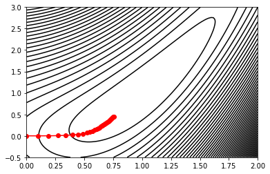
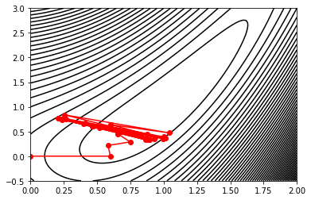

# qubit-note: Gradient Descent

## Overview

Very often we want to calculate the maximum or minimum locations of a function. Another similar problem is to find the paramters
of a function in order to minimize or maximize a certain condition. Both problems are of practical interest.

In this short note, I discuss the <a href="https://en.wikipedia.org/wiki/Gradient_descent"> gradient descent</a> algorithm also known as steepest descent.

**keywords** graident-descent, unconstrained-optimization, numerical-methods 


## Gradient descent

Let's consider the scenario where we have a number of data points at hand and we want to
fit a simple model into this dataset e.g. a linear regressor. 
We can use some sort of curve fitting techinque for this e.g. polynomial or exponential curve fitting.
Both admit best-fit least squares solutions, see [2]; however, these are specialized cases. Thus a more general framework is needed.


Gradient descent is one such approach that it is very simple iterative algorithm. 
It only has one parameter to tune i.e. the learning rate (and the number of iterations)
often denoted as $\eta$. I will use the example from [2]. Hence, consider the function:

$$f(\theta_1, \theta_2) = \frac{1}{2}(\theta_{1}^2 - \theta_2)^2 + \frac{1}{2}(\theta_1 -1)^2$$

Our goal is to find the parameters $(\theta_1, \theta_2)$ such that the function is minimised.
We can utilise the gradient direction for this and this is what gradient descent does; the gradient gives the direction of steepest descent towards the minimum point of $f$ [2]. 
The minimum point is located in the direction $-\nabla f$, where $-\nabla f$ denotes the gradient of the function. For our particular choice of $f$
this will be:

$$\boldsymbol{\theta}_k = \boldsymbol{\theta}_{k-1} - \eta \nabla f|_{\boldsymbol{\theta}_{k-1}} $$

$\eta$ is the so called learning rate and tunes how fast we move to the direction of the gradient. 
A small $\eta$ slows down convergence whilst a large value may not allow convergence of the algorithm. 
This is shown in the two figures below: 

|                                |
|:-----------------------------------------------------------:|
|             **Figure 1. Gradient descent with eta 0.1.**    |


|                                |
|:-----------------------------------------------------------:|
|             **Figure 2. Gradient descent with eta 0.6.**    |

The Python code snippet is a simple implementation of the gradient descent algorithm.

```
import numpy as np
import matplotlib.pyplot as plt


def f(theta1, theta2):
    return 0.5*(theta1**2 - theta2)**2 + 0.5*(theta1 -1.0)**2


def f_grad(theta1, theta2):
    return (2.0*theta1*(theta1**2 - theta2) + (theta1 - 1.0), -(theta1**2 - theta2))

def gd(eta, itrs, tol):
    
    
    coeffs_series = []
    coeffs = [0.0, 0.0]
    
    coeffs_series.append([coeffs[0], coeffs[1]])

    val_old = f(theta1=coeffs[0], theta2=coeffs[1])
    
    for itr in range(itrs):
        
        grad = f_grad(theta1=coeffs[0], theta2=coeffs[1])
        
        coeffs[0] -= eta*grad[0]
        coeffs[1] -= eta*grad[1]
        
        coeffs_series.append([coeffs[0], coeffs[1]])
        
        val = f(theta1=coeffs[0], theta2=coeffs[1])
        
        abs_error = np.abs(val - val_old)
        
        if itr % 10 == 0:
            print(">Iteration {0} absolute error {1} exit tolerance {2}".format(itr, abs_error, tol))
        
        if abs_error < tol:
            print(">GD converged with residual {0}".format(np.abs(val - val_old)))
            return coeffs_series
        
        val_old = val
    return coeffs_series


coeffs_series = gd(eta=0.1, itrs=100, tol=1.0e-4)


# plot

coeffs_x = []
coeffs_y = []
for item in coeffs_series:
    
    coeffs_x.append(item[0])
    coeffs_y.append(item[1])


theta1 = np.linspace(0.0, 2.0, 100)
theta2 = np.linspace(-0.5, 3.0, 100)


X, Y = np.meshgrid(theta1, theta2)

Z = f(X, Y)

plt.contour(X, Y, Z, 60, colors='black');
plt.plot(coeffs_x, coeffs_y, 'r-o')
plt.show()

```


## References

1. <a href="https://en.wikipedia.org/wiki/Gradient_descent">Gradient descent</a>
2. Kevin P. Murphy, _Machine learning a probabilistic perspective_, The MIT Press
3. Steven L. Brunton and J. Nathan Kutz, _Data-driven science and engineering. Machine learning, dynamical systems and control_, Cambridge University Press.
