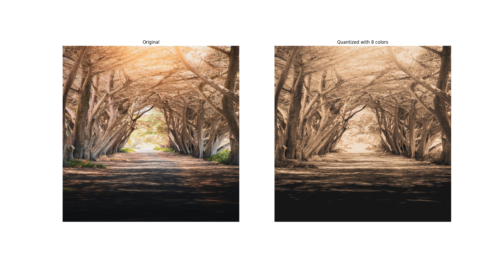

# qubit-note: K-means for Image Quantization

## Overview

Color quantization refers to the process of reducing the number of distinct colors that are used in
the representation of an image. From wikipedia: 

_Color quantization is critical for displaying images with many colors on devices that
can only display a limited number of colors, usually due to memory limitations,
and enables efficient compression of certain types of images._

K-means is an approach we can use for color quantization. Let's discuss how this can be done.

## K-means for color quantization

K-means for color quantization is a method used to reduce the number of distinct colors in an image while preserving its overall visual appearance. Instead of storing all unique colors, it groups similar colors into clusters and represents each cluster with a single color (its centroid).
Let's see how such an appraoch works.

We know that each pixel in an image in the   RGB has three channels; one for every color, see chapter [#sec-pinhole-camera-model-working-with-images]. For an image with many pixels, this creates a large dataset of color points. K-means requires to choose $k$; the number of clusters. We 
then randomly initialize $k$ cluster centroids in the color space. Iteratively, we assign each pixel to the nearest centroid based on Euclidean distance in RGB space. At each iteration, we recalculate centroids based on assigned pixels and repeat until convergence. Finally, we Replace each pixel’s color with its cluster centroid color. This is a very simple quantization approach however it has the following disadvantages:

- Requires selecting K, which affects quality and compression ratio.
- Sensitive to initialization and outliers.
- May not perform well on images with subtle gradients.

The following Python code implements K-means for image quantization:

```
import cv2
import numpy as np
from sklearn.cluster import KMeans
import matplotlib.pyplot as plt

if __name__ == '__main__':

	# Load image (BGR to RGB)
	image = cv2.imread("./imgs/img.jpg")
	image = cv2.cvtColor(image, cv2.COLOR_BGR2RGB)

	# Reshape image into a list of pixels
	pixels = image.reshape((-1, 3))

	# Number of colors (clusters)
	K = 8

	# Apply K-means clustering
	kmeans = KMeans(n_clusters=K, random_state=42)
	kmeans.fit(pixels)

	# Replace each pixel with its cluster center
	quantized_pixels = kmeans.cluster_centers_[kmeans.labels_]
	quantized_image = quantized_pixels.reshape(image.shape).astype(np.uint8)

	# Display original and quantized images
	plt.figure(figsize=(10, 5))
	plt.subplot(1, 2, 1)
	plt.imshow(image)
	plt.title("Original")
	plt.axis("off")

	plt.subplot(1, 2, 2)
	plt.imshow(quantized_image)
	plt.title(f"Quantized with {K} colors")
	plt.axis("off")

	plt.show()

```

Running the code produces the following result:




## Summary

Color quantization is the process of reducing the number of distinct colors in an image to save memory and enable efficient compression while preserving visual quality. 
One common method is K-means clustering, which groups similar colors into clusters and replaces each pixel’s color with its cluster centroid. This involves representing each pixel in RGB space, selecting a number of clusters  $k$ assigning pixels to the nearest cluster, recalculating centroids iteratively, and updating pixel colors. 
While simple and effective, this approach requires choosing $k$ carefully, is sensitive to initialization and outliers, and may struggle with images containing subtle gradients.

## References

1. <a href="https://en.wikipedia.org/wiki/Color_quantization">Color quantization</a>