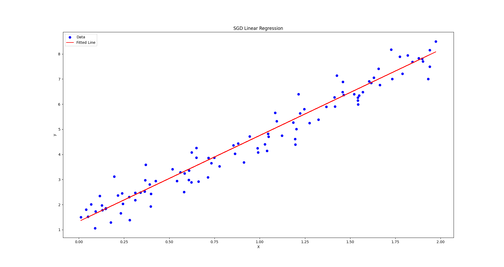

# qubit-note: Linear Regression Model

## Overview

The two dominant models in supervised learning are regression and classification modeling. In the former, the output of the model is a real value whilst for the latter its a class index.  More generally, in regression modeling we associate an input vector $\mathbf{x} \in \mathbb{R}^N$ with a continuous variable $y\in \mathbb{R}$ whilst in classification modeling the vector $\mathbf{x}$  is associated with a $y \in \mathbb{N}$. There are various models we can use for regression modeling e.g. k-nearest neighbors or decision trees. In this section however, we restrict attention to a more humble approach and perhaps one of the most known statistical modeling approaches i.e. the <a href="https://en.wikipedia.org/wiki/Linear_regression">linear regression model</a>. You can find out more on this and other topics at <a href="https://github.com/pockerman/ml_notes">Statistics, Probability and Machine Learning Notes</a>.


**keywords** linear-regression-model, statistical-modelling, scikit-learn, Python

## Linear regression model

In Statistics, linear regression represents a linear model of the relationship between a scalar target variable  $y$ and one or more explanatory variables $x_1, \dots, x_k $ [1]. The variables $y$ and $x_i$ are also known as dependent and independent variables respectively [1]. When only one explanatory variable is used the method is also called **simple linear regression**. When  more than one explanatory variables are involved, then the process is called **multiple linear regression** [1]. 


The generic regression function is given by [4]:

$$
r(x) = E\left[Y|X=x \right] = \int y f(y|x) dy
$$

One way to estimate $r$ is by using a data set. In this section we fix attention to parametric linear models. In particular, a linear regression model using $k$ features has the following form

$$y = w_0 + w_1x_1+ \dots + w_{k}x_k + \epsilon$$

Note that the term linear refers to the weights and not to the functional form of the features.  $\epsilon$ represents some error term with $E\left[\epsilon |X\right]=0$ and $Var\left[\epsilon |X\right]=\sigma^2$. Notice that we can say something about the error of the model given the data $X$.

----

**Remark**


Given what we said above, the following is also under the umbrella of the linear regression model

$$y = w_0 + w_1x_{1}^2+ \dots + w_{k}x_{k}^2 + \epsilon$$

although this is not a linear model with respect to the features.

----

----

**Generalized linear models**

Linear regression falls under the umbrella of <a href="https://en.wikipedia.org/wiki/Generalized_linear_model"> generalized linear models</a>. A GLM models the relationship between $\mathbf{x} \in \mathbb{R}^N$ and $y$ as


$$y = \mathbf{w}^T \mathbf{x} + \epsilon$$


----

The term $w_0$ is the bias or interception term. The rest of the weights represent the amount that $y$ changes when the variable associated with that specific weight changes given that the rest of the variables remain the same. Given the assumed functional form among the independent variables, we need to estimate the weights $w_i$. This is done by fitting the model in the available data. The following  image shows a line fitted in a one dimensional data set 


|               |
|:-----------------------------------------------------------:|
|      **Figure 1. Linear regression model fitted using SGD.**    |

Linear regression was the first type of regression analysis to be studied rigorously, and to be used extensively in practical applications [1]. This is because models which depend linearly on their unknown parameters are easier to fit than models which are non-linearly related to their parameters and because the statistical properties of the resulting estimators are easier to determine [1].


### Fitting the model

We now come to the question how can we fit the model above in the data? Linear regression models are often fitted using the <a href="https://en.wikipedia.org/wiki/Least_squares">least squares approach</a>. However, they may also be fitted in other ways, such as by minimizing the "lack of fit" in some other norm (as with least absolute deviations regression), or by minimizing a penalized version of the least squares cost function as in ridge regression (L2-norm penalty) and lasso (L1-norm penalty) [1]. Let's describe how the least squares method works

#### Least squares

Perhaps the most common way to estimate the parameters of a statistical model is compute the maximum likelihood estimate or MLE [2]. Given a model on a data set $\mathbf{X}_{n \times m}$ and parameters $\mathbf{w}$, the MLE estimate is defined as [2]

$$\mathbf{\hat{w}} = argmax_{\mathbf{w}} log p(\mathbf{X}|\mathbf{w})$$

Let's consider the simple one dimensional model

$$\hat{y}_i = w_0 + w_1x_i + \epsilon_i$$

For each observation, we commit an error by using the model above. Let $\hat{y}_i$ be the model prediction and $y_i$ be the actual value. We define the error associated with $\hat{y}_i$ as $\epsilon_i$

$$\epsilon_i = \hat{y}_i - y_i$$

The total error then will be:

$$\epsilon = \sum_i \epsilon_i$$ 

Ordinary least squares minimize the  sum of the squared errors i.e.

$$ L = \sum_i \epsilon_{i}^{2}$$

----

**Remark**

Why do we take a square of the errors? The reason is that if we do not take the squares of the errors, the positive and negative terms can cancel each other.

----

The solution to this minimization problem is called ordinary least-squares solution and it is given by the following expression [2]:

----

**Ordinary least squares solution**

$$\mathbf{\hat{w}}_{OLS} = \left(\mathbf{X}^T\mathbf{X}\right)^{-1}\mathbf{X}^T\mathbf{y}$$

The equations implied by the solution above i.e.

$$\mathbf{X}^T\mathbf{X}\mathbf{\hat{w}} =  \mathbf{X}^T\mathbf{y}$$

are known as the <a href="https://mathworld.wolfram.com/NormalEquation.html">normal equations</a>.

----

This solution is unique, provided that the  matrix $\mathbf{X}^T\mathbf{X}$ is invertible which means that $det(\mathbf{X}^T\mathbf{X})$ should not be equal to zero. This is always possible if the matrix $\mathbf{X}$ representing the data set, has full rank with respect to the columns. specifically, if $rank(\mathbf{X}) = m$, then the features are linearly independent and thus $\mathbf{X}^T\mathbf{X}$ has no columns or rows that are proportional to others (something that would lead to $det(\mathbf{X}^T\mathbf{X})=0)$.  Another viewpoint about uniqueness is provided by the fact that the loss function $L$ is a quadratic function thus is should have a global minimum point. 

Thus the $\hat{\mathbf{w}}_{OLS}$ is the least squares estimate that minimizes $L$.

----

**Least squares estimate and MLE**

Above we assumed that $\epsilon \sim N(0, \sigma^2)$. In this case, the least squares estimator is also the maximum likelihood estimator [4].

----

Let's see an example using ```scikit-learn```.

```
# %matplotlib inline <---uncomment if using jupyter lab
import matplotlib.pyplot as plt
import seaborn as sns; sns.set()
import numpy as np
from sklearn.metrics import r2_score
from sklearn.linear_model import LinearRegression


rng = np.random.RandomState(1)
x = 10 * rng.rand(50)
y = 2 * x - 5 + rng.randn(50)
plt.scatter(x, y);

model = LinearRegression(fit_intercept=True)

model.fit(x[:, np.newaxis], y)

xfit = np.linspace(0, 10, 50)
yfit = model.predict(xfit[:, np.newaxis])

plt.scatter(x, y)
plt.plot(xfit, yfit);

print("Model slope:    ", model.coef_[0])
print("Model intercept:", model.intercept_)

# The coefficient of determination, see the section **Evaluating the model**, is  

print("Model r^2={0}".format(r2_score(y, yfit)))

# Let's verify that the loss function is indeed quadratic. We do so without accounting for the bias term.

intersepts = np.linspace(-6.0, 6.0, 1000)
loss = []
for w in intersepts:
    yfit = w * xfit
    loss.append(sum((y - yfit)**2))  
plt.scatter(intersepts, loss)  
plt.xlabel('w')  
plt.ylabel('L')  
plt.show()

```

#### Evaluating the model

Ok we fit the model to the data but how good is that fit? In other words, we need some way(s) to assess the goodness of fit of the model. One such metric, is the <a herf="https://en.wikipedia.org/wiki/Coefficient_of_determination">**coefficient of determination**</a> $r^2$ [3]. 

The coefficient of determination indicates the percent of variance in $y$ that is explained or accounted for by the independent variable $x$. For linear regression involving just one predictor or independent variable, the coefficient of determination $r^2$ is just the Pearson correlation coefficient between $y$ and $x$ [3] i.e.

$$r^2 = (\rho(y,x))^2$$

The value of $r^2$ ranges between 0 and 1. A value of $r^2=0$ means that there is no fit at all between the model and the data, i.e. that no percentage of the variance in $y$ is explained by $x$. This means that knowing $x$, and using a linear model, tells us nothing about $y$ [3]. A value of $r^2=1$ means a perfect fit of the model and the data and $100\%$ of the variance in $y$ is explained by $x$ or if we know $x$ then we fully know $y$.

----

**Remark**

The coefficient of determination belongs to a family of statistics called variance accounted for indices. Other notable members of this family are the $R^2$ coefficient for multiple regression and the $\eta^2$ coefficient from ANOVA [3]. When we see any member of this family, we should think **percent improvement in predictive accuracy** [3].


----

We are also interested in the expected value, the variance as well as  confidence intervals for the obtained least squares estimates. These are given below, see also [4],

$$
E\left[\hat{\mathbf{w}}_{OLS}|X\right] = \mathbf{w}
$$

i.e. $\hat{\mathbf{w}}_{OLS}$ is an unbiased estimate of $\mathbf{w}$. The variance of the estimate is [4]

$$
Var\left[\hat{\mathbf{w}}_{OLS}|X\right] = \frac{\sigma^2}{Ns^{2}_{X}} \begin{pmatrix} \frac{1}{N}\sum x_{i}^2 & -\bar{x} \\
-\bar{x} & 1\end{pmatrix}
$$

####  Model assumptions

Mathematical models, being simplifications of phenomena, make certain assumptions and linear regression is not an exception. In this subsection we want to go over these assumptions. The assumptions below are taken from [3] and they should be met whenever we want to use bivariate regression for modeling purposes. These are:

- Linearity
- Independence
- Homogeneity of variance
- Normality
- Bivariate normality

Let's briefly explain what each of these assumptions means in practice. Linearity means that $y$ should be a linear function of $x$ or at least a linear model is a good approximation of their dependence. Pearson's coefficient $\rho$ and a scatter plot can tells us quantitatively and qualitatively whether this is the case or not. Independence, means that each observation $x_i$ should be drawn independently from the population of interest. For example, the researcher should take repeated measures on the same variable from the same participant [3].  Homogeneity of variance (or homoscedasticity) means that the variance of the dependent variable $Y$ should remain fairly constant at all values of $X$. The normality assumption refers to how the residuals are distributed. Specifically, these should be normally distributed [3]. However, violation of this assumption is only serious with relatively small samples. The final assumption is bivariate normality assumption.  This refers to the fact that any specific score on one of the variables, scores on the other variable should follow the normal distribution.


## Summary

This qubit note discussed the linear regression model a fundamental statistical model for analyzing relationships between dependent and independent variables.  We explained the formulation of linear regression, including simple and multiple regression, and describes how parameters are typically estimated using the least squares method, which minimizes the sum of squared errors and coincides with maximum likelihood estimation under normal error assumptions. The discussion highlights the importance of evaluating model fit through metrics like the coefficient of determination ($r^2$), while also emphasizing key model assumptions such as linearity, independence, homoscedasticity, and normality of residuals. Linear regression’s simplicity, interpretability, and well-studied statistical properties make it one of the most widely used approaches in practice


## References

1. <a href="https://en.wikipedia.org/wiki/Linear_regression">Linear regression model</a> 
2. Kevin P. Murphy, _Machine Learning A Probabilistic Perspective_, The MIT Press.
3. Larry Hatcher, _Advanced statistics in research_, Shadow Finch Media.
4. Larry Wasserman, _All of Statistics: A concise course in statistical inference_, Springer.

