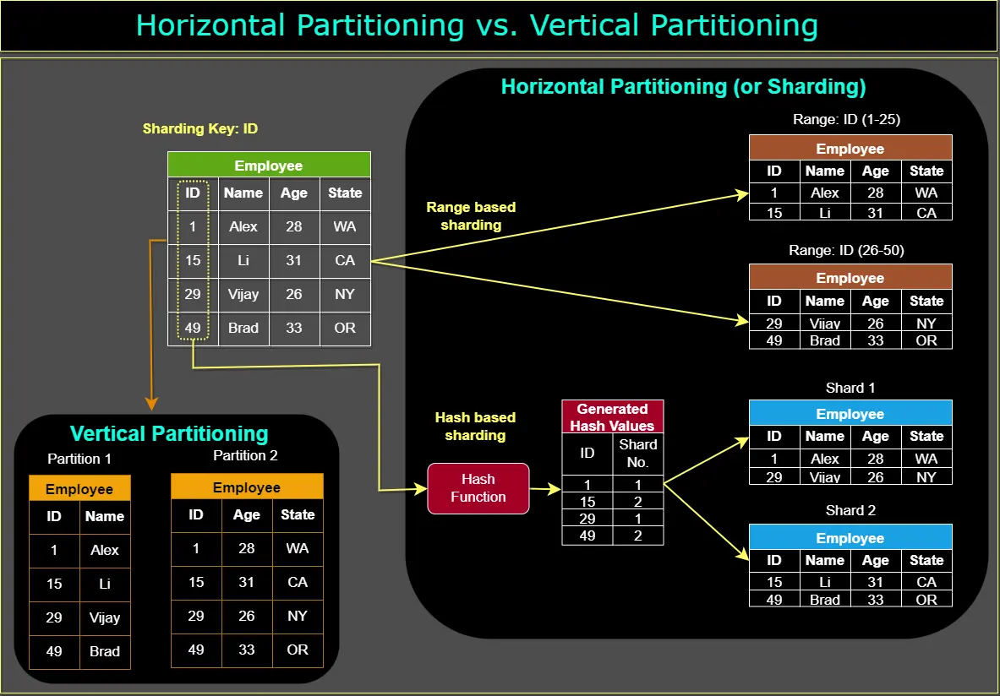

# qubit-note: Distributed Systems Design Concepts Part 2

## Overview

In this note, we will look into the following concepts

- Caching; Temporarily store frequently used data to speed up future access.
- Data partitioning; Splits large datasets into smaller chunks (shards) to spread the load across servers.
- Data replication; Creates and maintains copies of data across different servers for better availability and fault tolerance.
- Distributed messaging systems; Enable services to communicate by sending messages asynchronously via a queue (e.g. Kafka, RabbitMQ).
- Microservices; A system design where different features are split into small, independent services that work together.

The material in this note is primarily taken from [1].

## Distributed Systems Design Concepts Part 2

**Caching**

A cache is a fast storage layer used to reduce latency and improve performance by storing frequently accessed data closer to the application. When data is requested, the system first checks whether it exists in the cache; if it does, the cached copy is returned immediately, avoiding slower access to the original data source such as a database or remote service. If the data is not cached, it is fetched from the original source, stored in the cache for future requests, and then returned to the application. In distributed systems, caching can be implemented at multiple layers including the client, DNS, CDN, API gateway, load balancer, server, and database, helping improve scalability, responsiveness, and overall system efficiency.

Note that we can also have - <a href="2026-04-28-Negative-Caching.md">negative caching</a> meaning cache requests that returned for example 404.

**Data partitioning**

Database partitioning is a technique used to improve scalability and performance by splitting data into smaller parts. Horizontal partitioning, also known as sharding, divides the rows of a table across multiple servers or database instances, distributing traffic and storage load to improve performance and scalability in large systems. In contrast, vertical partitioning splits a table by columns, placing different groups of columns into separate tables to reduce table width and optimize queries that only require a subset of the data. While horizontal partitioning focuses on scaling data volume and throughput, vertical partitioning focuses on improving query efficiency and reducing unnecessary data access.

**Data partitioning. Image from [1]**

**Data replication**

Database replication is a technique used to maintain multiple synchronized copies of the same database across different servers or locations in order to improve availability, fault tolerance, and performance. In a typical replicated setup, one database acts as the primary (master) handling writes, while replicas (slaves) receive synchronized updates and mainly serve read requests. Replication helps distribute read traffic across replicas, reducing load on the primary database and improving query response times. It also increases system reliability, since replicas can continue serving data if the primary database fails, and enhances data protection by maintaining redundant copies of the data across different machines or regions.

**Distributed messaging systems** 

Distributed messaging systems are infrastructure components that enable reliable, scalable, and fault-tolerant communication between distributed applications, services, or system components. They work by decoupling message producers from consumers, allowing different parts of a system to operate independently and communicate asynchronously. This design improves scalability, resilience, and flexibility, especially in large-scale distributed systems and microservices architectures where services may run on different machines or geographic regions. Messaging systems also help handle traffic spikes, retries, and event-driven workflows, with popular examples including Apache Kafka and RabbitMQ.

**Microservices**

Microservices are an architectural approach where an application is built as a collection of small, loosely coupled, and independently deployable services, each responsible for a specific business capability or domain. Unlike monolithic systems, microservices allow teams to develop, deploy, and scale services independently, improving flexibility, maintainability, and development speed. Each service typically owns its own data and business logic, promoting decentralization and separation of concerns, while communication between services happens through lightweight protocols such as HTTP/REST, gRPC, or messaging systems. Because services operate independently, failures in one microservice are less likely to bring down the entire application, improving system resilience and fault tolerance.

## Summary

This note summarizes several core distributed systems concepts commonly used to build scalable and reliable applications. Caching improves performance by storing frequently accessed data closer to the application, reducing latency and load on backend systems. Data partitioning splits large datasets either horizontally (sharding rows across servers) or vertically (splitting columns into separate tables) to improve scalability and query efficiency. Data replication maintains synchronized copies of databases across multiple servers to increase availability, fault tolerance, and read performance. Distributed messaging systems such as Apache Kafka and RabbitMQ enable asynchronous communication between independent services, improving scalability and resilience in distributed architectures. Finally, microservices organize applications into small, independently deployable services that communicate through lightweight APIs or messaging systems, allowing teams to develop, scale, and maintain systems more flexibly while improving fault isolation and overall system resilience.

## References

1. <a href="https://www.designgurus.io/blog/system-design-interview-fundamentals">25 Fundamental System Design Concepts You Must Know Before Your Interview</a>