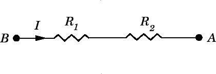
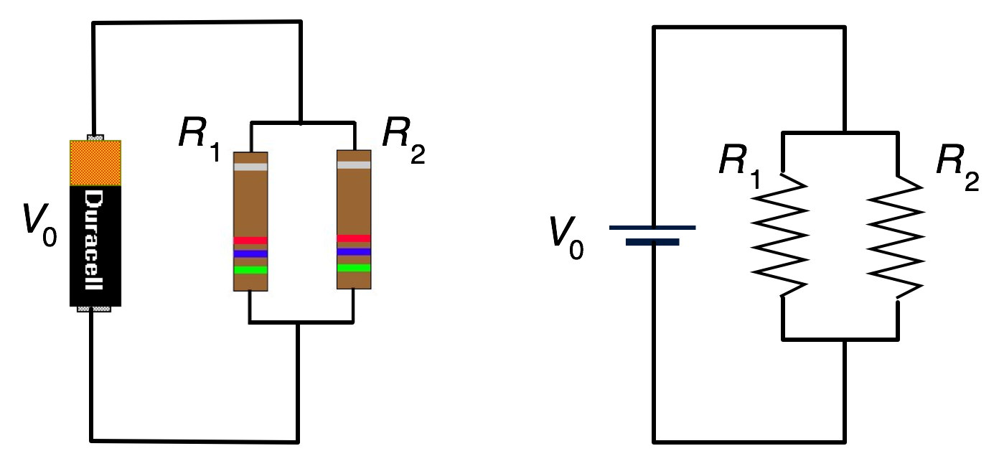

# qubit-note: Resistors

## Overview

<a href="2026-01-25-Electronic-Circuits-101.md">qubit-note: Electronic Circuits 101</a> introduced resistors as an essential element of an electronic circuit.
In this note we will dive a bit more into resistors.

**keywords** electronic-circuits,  resistors

## Resistors

A resistor is a component with two terminals. It turns electrical energy into heat. According to
<a href="https://en.wikipedia.org/wiki/Ohm%27s_law">Ohm’s law</a>, the voltage $V$ between the points A and B across the resistor $R$ in is proportional to the current $I$ from A to B through $R$.
This is expressed mathematically as follows:

$$
V=RI
$$

The constant of proportionality i.e. $R$ is called the resistance of the resistor. The units of $R$ are:

$$
[R] = \Omega = VA^{-1}
$$

The maximum power a resistor is able to dissipate without damage depends on its
type and the ambient temperature. Thus, resistors are not perfect. The value of a resistor’s resistance lies within a tolerance band of the resistance’s nominal value. 
Tolerances of $\pm10 \%$, $\pm5 \%$, and $\pm1 \%$ are common. Besides the power rating, a resistor has a maximum voltage limit too.
Exceeding this limit will permanently change the resistance. Moreover, a resistor’s
resistance depends on the resistor’s temperature. Standard types show a temperature
coefficient in the range of $\pm10 \times 10^{−6} K^{−1}$ to $\pm100 \times 10^{−6} K^{−1}$ . 
For precise measurement circuits, resistors with a temperature coefficient in a range smaller than
$\pm1 \times 10^{−6} K^{−1}$ can be obtained [1].

We have two main methods of connecting resistors together:

- Series connection
- Parallel connection

Let's look into these.

### Series connection

The series connection is very easy to understand as it is exactly what the term means; resistors placed one after another in a series.
This is shown in the image below.

The toral resistance between points $A$ anf $B$ is given from their sum i.e

$$
R = R_1 + R_2
$$

In general, for $N$ resistors connected in series the total resistance is given by:

$$
R = \sum_{i}^{N} R_i
$$

### Parallel connection

The parallel connection of resistors is hown in the image below:

In this case, the resistance of the circuit is:

$$
R = \frac{R_1R_2}{R_1 + R_2}
$$

In general, for $N$ resistors we have 

$$
\frac{1}{R} = \sum_{1}^{N} \frac{1}{R_i}
$$

## Summary

The note expands on the role of resistors in electronic circuits. A resistor is a two-terminal component that converts electrical energy into heat and obeys Ohm’s law, which states that the voltage across a resistor is proportional to the current through it, with resistance as the proportionality constant. Resistance is measured in ohms $\Omega$.

Real resistors are non-ideal: they have power dissipation limits, maximum voltage ratings, and manufacturing tolerances (commonly $\pm10\%, \pm5\%, or \pm1\%$). Their resistance also varies with temperature, described by a temperature coefficient; high-precision applications use resistors with extremely low temperature coefficients.

There are two fundamental ways resistors can be combined in circuits: series and parallel connections. In a series connection, resistors are placed end-to-end and the total resistance is simply the sum of all individual resistances. In a parallel connection, resistors share the same two nodes, and the total resistance is given by the reciprocal of the sum of reciprocals of the individual resistances (for two resistors, the product-over-sum formula applies).

## Refernces

1. Peter Hintenaus, _Engineering Embedded Systems Physics, Programs, Circuits_, Springer