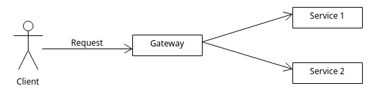

# qubit-note: Deploy Microservices with Kubernetes 101

## Overview

In this note, I want to go over the basics of deploying microservices with Kubernetes on your local machine. Speciffically, we will deploy
three microservices. One acting as a simple gateway of the two others.  The <a href="https://microservices.io/patterns/apigateway.html">api gateway</a>
is a commonly used architectural pattern for microservices. Consider for example a number of ML models exposed via endpoints.
A commonly used approach to deploy these models, is to use microservices.

**keywords:** Kubernetes, Docker, API-gateway,Python


## Deploy Microservices with Kubernetes 101

In this note, I want to go over the basics of deploying microservices with Kubernetes on your local machine. Speciffically, we will deploy
three microservices. One acting as a simple gateway of the two others.  The <a href="https://microservices.io/patterns/apigateway.html">api gateway</a>
is a commonly used architectural pattern for microservices. Consider for example a number of ML models exposed via endpoints.
A commonly used approach to deploy these models, is to use microservices. The API gateway pattern is shown shematically in the image below.

|  |
|:----------------------------------------------------:|
| **Figure 1: API gateway pattern.**                   |


The material covered in this post
is discussed in great detail in [1]. You can find the source code for this post here <a href="https://github.com/pockerman/kubernetes_101/tree/main">Kubernetes_101</a>.

 In order to use the files make sure that you build  your own Docker images and push these a public Docker hub repository. For example,


 ```
 cd info_service
 docker build -t kubernetes-ml-info-api:0.1
 docker tag kubernetes-ml-info-api:0.1 <your-repo-name>/<your-image-name>:<your-image-tag>
 docker push <your-repo-name>/<your-image-name>:<your-image-tag>

 ```

 Depending on your setting, you many need to login to docker via the docker CLI using

 ```
 docker login
 ```

 Note also that you may need to adapt the supplied Kubernetes files to match the names above.

Kubernetes has a steep learning curve. Checkout [1] for an in depth coverage.
However, here are the basic elements you need to know to get you started.

Kubernetes is an open source container orchestration tool originated from Google. 
Apart from container orchestration, Kubernetes can also helps us automate deployments, and it handles graceful rollouts
and rollbacks, scaling applications, and more.

Within Kubernetes, the smallest unit of computing is the pod. Simply put a pod is a wrapper around containers
and can include one or more of them. The most common practice is to run one
container per _pod_ and this is what we will follow herein.

Note however, that when using Kubernetes, we rarely work with pods. Instead, in order to deploy a pod
one typically works with workloads. Kubernetes has four types of workloads [1]:

- _Deployment_
- _StatefulSet_
- _DaemonSet_
- _Job/CronJob_ 


We won't go into details over these types of workload herein. If you want more information, check [1].
It is mentioned however that a  _Deployment_ is the most common type of Kubernetes workload and is useful 
for running stateless ditributed applications.

Although a _Deployment_ object allows us to deploy a _pod_, it does not allow us to access this
_pod_ outside the Kubernetes cluster. Kubernetes offers several solutions to do so see [1].
Herein we will be utilizing Service objects. Service objects can be of different types.
In this post we will use the _ClusterIP_ and the _LoadBalancer_ types. We will see 
below what these two types constitute.

## The application

What we will develop in this post is a simple FastAPI application consisting of three service.
The first service is the gateway to the other two. In that respect, the three services are

- gateway; listening at port 8001
- service-1; listening at port 8002
- service-2; listening at port 8003


Firts let's see if everything works as expected. Fire up the script

```
./start_unvircorn.sh 
```

that is present in each service and navigate to

```
http://0.0.0.0:8001/docs
```

You should be able to see the documentation for the API. Try to execute the endpoint for each service and make sure that you get
back the right response. Now that we confirm that the applications work as expected, let's try to containerise them.


### Building Docker images

We need to build the Docker images for the microservices and push them to Docker Hub. Make sure that these are made public
so that Kubernetes can access these.

```
docker build -t k8s_101_service_gateway:latest .
docker build -t k8s_101_service_1:latest .
docker build -t k8s_101_service_2:lates .
```


Now that we have the images built locally we can push these to Docker Hub. For example

```
docker tag k8s_101_service_2:v1 alexgiavaras/k8s_101_service_2:latest
docker push alexgiavaras/k8s_101_service_2:latest
```

### Using Kubernetes

Now that we have the images uploaded, let's use Kubernetes to launch locally a cluster. 
I am using <a href="https://minikube.sigs.k8s.io/docs/">minikube</a> for this, but feel free to use the tool of your choice eg. <a href="https://kind.sigs.k8s.io/">kind</a>. 

Minikube will run a single-node Kubernetes cluster. Let's see how to expose the three services to the world.
First expecute the scripts under the ```setup``` directory using

```
minikube kubectl -- apply -f setup/ --recursively
```

This will create three Pods for the three services. Verify that the Pods are running

```
minikube kubectl -- get pods -A
```

The command above should return a list of pods that exist into your local cluster. Ideally, the pods should be at a Running state.
However, this does not mean that the services are accessible. We need the address of the pod
in order to access the application running on it. However, pods are ephmeral; a pod can be removed and replaced with a new one at any time, which means that their address will change. In addition, we have three pods runnning, one for each service. In order to access a service that is running on another pod we again need the IP of this pod. This IP is not known before the pod is built. Another point to consider is horizontal scaling.
In this case, replicas of the pod provide the same service. Each of these replicas has its own IP address. If another pod needs to connect to these replicas, it should be able to do so using a single IP or DNS name that points to a load balancer that distributes the load across all replicas [1].

One way to access the functionality of the application is by using a Kubernetes service. This is an object that provides a single, stable access point to a set of pods that provide the same service. In constrast to a pod, a service has a stable IP address which remains the same  as long as the service exists [1]. Clients interact with the application by using the exposed IP address and port of the service. The requests
will then be forwarded to one of the pods that actually back the service. 

There are several service types supported by Kubernetes. In this post we will only use the _ClientIP_ and the _LoadBalancer_ service types.
More information about the Kubernetes services can be found <a href="https://kubernetes.io/docs/concepts/services-networking/service/">here</a>.
A _ClientIP_ service has a cluster-scoped virtual IP address. Clients can connect using that virtual IP address, and Kubernetes then load-balances traffic to that Service across the different backing Pods [2].  If we create a service object without specifying the type of the service, that’s the type of service we get [1]. The following script shows the manifest file for the service-1 in the little demo

```
apiVersion: v1
kind: Service
metadata:
  name: ml-service1
spec:
  type: ClusterIP
  selector:
    app: ml-service1
  ports:
  - name: http
    port: 80
    targetPort: 8002
    protocol: TCP
```

According to the manifest snippet above, the service accepts connections on port 80 and forwards each connection 
to port 80 of a randomly selected pod matching the ```app:ml-service1```. 
Similarly, the next snippet shows the manifest file for the ```ml-inference-service```

```
apiVersion: v1
kind: Service
metadata:
  name: ml-inference-service
spec:
  type: LoadBalancer
  selector:
    app: ml-inference-service
  ports:
  - name: http
    port: 80
    nodePort: 30080
    targetPort: 8001
  - name: https
    port: 443
    nodePort: 30443
    targetPort: 8443
```

We can create these services by using

```
minikube kubectl -- apply -f services/svc.service1.yaml
minikube kubectl -- apply -f services/svc.service2.yaml 
```

When a service is created, it is assigned an internal IP address. Any workload running in the cluster can use 
it in order to connect to the pods that are part of that service. This is the cluster IP address of the service. 
As mentioned previously, a  ```ClusterIP``` service is accessible only within the cluster, from other pods and from the cluster nodes. 
You can’t access them from your own machine. 
Hence in order to see if a service is actually working, you must for example log in to one of the nodes with ```ssh``` and connect to the service from there. 
For more details check [1].


Now we can deploy the ```ml-inference-service``` using 

```
minikube kubectl -- apply -f services/svc.inference.loadbalancer.yaml
```

and then use 

```
minikube service ml-inference-service
```

Navigate to the docs page of the application and you should be able to get the responses from ```ml-service1``` and ```ml-service2```.
But how does the ```ml-inference-service``` knows the IPs of the other two services. One way to find out that information
is via environment variables. However, we have used is DNS resolution. In particular, Kubernetes clusters run an internal DNS server that all pods in the cluster are configured to use. 
In most clusters, this internal DNS service is provided by _CoreDNS_, whereas some clusters use ```kube-dns``` [1]. 
You can see which one is deployed in your local cluster by listing the pods in the ```kube-system``` namespace. 
Regardless of the implementation that your cluster is using, it allows pods to resolve the cluster IP address of a service by name. 
Using the cluster DNS, pods can therefore connect to say ```ml-service2``` via:

```
http://ml-service2
```

A service is resolvable under the following DNS names [1]:


- ```<service-name>```, if the service is in the same namespace as the pod performing the DNS lookup,
- ```<service-name>.<service-namespace>``` from any namespace
- ```<service-name>.<service-namespace>.svc```
- ```<service-name>.<service-namespace>.svc.cluster.local```.

## Summary

In this post we looked into how to create a simple API gateway with Kubernetes. The post did not go into very fine details such as database connectivity e.t.c.
In addition, one of the things we would like to change, is how we obtain the DNS for the services behind the gateway. These currently
are hardcoded into the code which may not be the best approach to follow.

The approach we implemented herein it suited if a single service it exposed. It becomes however problematic with large numbers of services, since each service needs its own public IP address.
We can overcome the aforementioned problem by exposing these services through an _Ingress_ object, see  [1] for more details.
Apart from providng a single IP address, an _Ingress_ object provides HTTP authentication, cookie-based session affinity and URL rewriting [1].
These are features that a service object cannot provide.


## References

1. <a href="https://www.manning.com/books/kubernetes-in-action-second-edition">_Kubernetes in Action_, Manning Publications, 2nd Edition</a>.
2. <a href="https://kubernetes.io/docs/concepts/services-networking/cluster-ip-allocation/">Service ClusterIP allocation</a>
