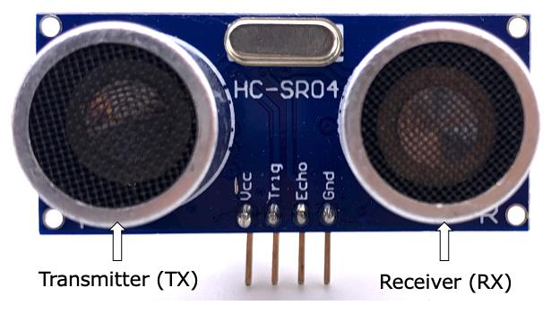
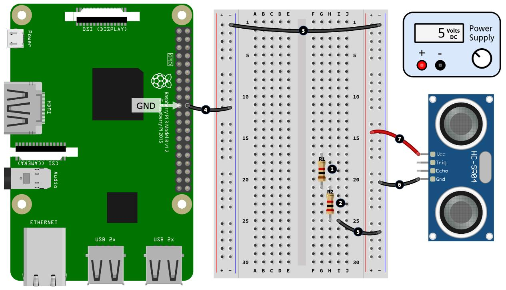
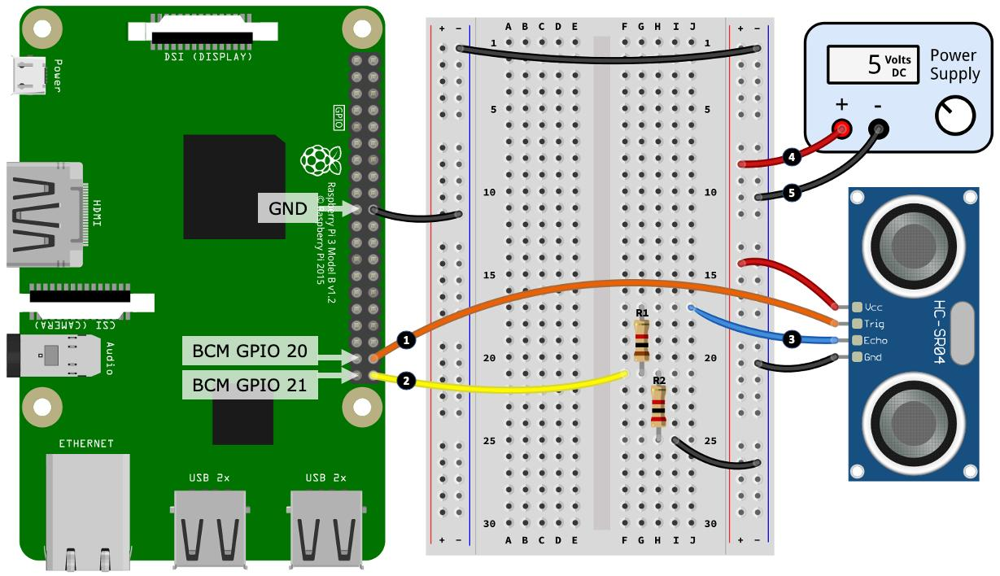

# qubit-note: RaspeberryPi Series | Measuring Distance With HC-SR04 Sensor


## Overview

In  this qubit-note will show how to measure distance using the popular  HC-SR04 ultrasonic distance
sensor. In addition, we will be sendin the measured distance to be consumed by a process running on a different machine via MQTT.
We will be working with Raspberry Pi 5 in this note.

**keywords** Programming, Raspberry-pi, Embedded-systems, Sensors, HC-SR04

## Measuring Distance With HC-SR04 Sensor

The HC-SR04 sensor is shown in the image below:


|       |
|:----------------------------------------------:|
|     **Figure: HC-SR04 distance sensor module.**|


The HC-SR04 ultrasonic sensor has two main components: a transmitter (TX) that emits ultrasonic pulses and a receiver (RX) that detects them. It has four pins: Vcc (5V power), GND (ground), TRIG (trigger input to send pulses), and ECHO (output that goes HIGH when a pulse is detected). Common uses include car parking sensors, where they measure distance to nearby objects, and liquid-level monitoring, such as measuring water depth in a tank.

When TRIG is HIGH the sensor sends out ultrasonic pulses. When the ECHO  pin goes HIGH when TRIG is made HIGH, then
transitions to LOW when it detects an ultrasonic pulse [1].

The circuit for this qubit-note is taken from [1] and it shown below in two parts:


|    |
|:---------------------------------------------------:|
|    **Figure: HC-SR04 distance sensor module. Image from [1]** | 


|    |
|:---------------------------------------------------:|
|    **Figure: HC-SR04 distance sensor module. Image from [1]** | 


Here is the Python script to run on the Pi

```
"""
Ultrasonic Distance Measurement Example (HC-SR04)
Tested for Raspberry Pi 5
"""
import datetime
import lgpio
import time
import paho.mqtt.client as mqtt

# hostname -I on the machine that hosts MQTT
BROKER = "192.168.0.212"
PORT = 1883
ULTRASOUND_TOPIC = "ultrasound"

# HC-SR04 pins
TRIG_GPIO = 20
ECHO_GPIO = 21

# Speed of sound (m/s)
VELOCITY = 343

# Timeout values
TIMEOUT_SECS = 0.1
SENSOR_TIMEOUT = -1

# Open GPIO chip
h = lgpio.gpiochip_open(0)

# Configure pins
lgpio.gpio_claim_output(h, TRIG_GPIO)
lgpio.gpio_claim_input(h, ECHO_GPIO)

# Ensure trigger is LOW
lgpio.gpio_write(h, TRIG_GPIO, 0)


def trigger():
    """Send 10µs trigger pulse"""
    lgpio.gpio_write(h, TRIG_GPIO, 0)
    time.sleep(0.000002)

    lgpio.gpio_write(h, TRIG_GPIO, 1)
    time.sleep(0.00001)  # 10 µs

    lgpio.gpio_write(h, TRIG_GPIO, 0)


def get_distance_cms():
    """Measure distance in centimeters"""
    trigger()

    timeout = time.time() + TIMEOUT_SECS

    # Wait for echo HIGH
    while lgpio.gpio_read(h, ECHO_GPIO) == 0:
        if time.time() > timeout:
            return SENSOR_TIMEOUT
    start_ns = time.perf_counter_ns()

    # Wait for echo LOW
    while lgpio.gpio_read(h, ECHO_GPIO) == 1:
        if time.time() > timeout:
            return SENSOR_TIMEOUT
    end_ns = time.perf_counter_ns()

    # Time elapsed (seconds)
    elapsed_seconds = (end_ns - start_ns) / 1_000_000_000 / 2

    # Distance calculation
    distance_m = elapsed_seconds * VELOCITY
    distance_cm = distance_m * 100

    return distance_cm


if __name__ == "__main__":

    client = mqtt.Client()
    client.connect(BROKER, PORT, 60)
    try:
        print("Press Ctrl+C to exit")

        while True:
            distance = get_distance_cms()

            if distance == SENSOR_TIMEOUT:
                print("Timeout")
            else:
                print(f"{distance:.2f} cm")

                z_str = json.dumps({"distance": distance,
                                    "unit":"cm",
                                    "timestamp": str(datetime.datetime.now(datetime.UTC))}
                                   )
                client.publish(topic=ULTRASOUND_TOPIC, payload=z_str)


            time.sleep(0.25)  # Do not exceed sensor rate

    except KeyboardInterrupt:
        print("\nExiting...")

    finally:
        lgpio.gpiochip_close(h)

```

The C++ code is shown below:

```
#include "bitrl/bitrl_config.h"
#ifdef BITRL_MQTT

#include "bitrl/network/mqtt_subscriber.h"
#include "bitrl/sensors/messages/ultrasound.h"

#include <chrono>
#include <iostream>
#include <thread>
#include <iomanip>

int main()
{

    using namespace bitrl;

    network::MqttSubscriber ultrasound_subscriber("tcp://localhost:1883", "ultrasound");
    ultrasound_subscriber.connect();

    while (true)
    {
        auto message = ultrasound_subscriber.poll(std::chrono::milliseconds(3000));

        if (message.has_value())
        {
            auto reading = sensors::UltrasoundMessage::parse(message.value());
            if (reading.has_value())
            {

                auto read_message = reading.value();

                std::time_t t = std::chrono::system_clock::to_time_t(read_message.source_timestamp);
                std::tm tm = *std::localtime(&t);
                std::cout<<"Distance received: "<<read_message.distance<<std::endl;
                std::cout<<"Units    received: "<<read_message.unit_str<<std::endl;
                std::cout<<"Generated      at: "<< std::put_time(&tm, "%Y-%m-%d %H:%M:%S")<<std::endl;
            }

        }

        std::this_thread::sleep_for(std::chrono::microseconds(200));
    }

    return 0;
}

#else
#include <iostream>
int main()
{
    std::cerr << "This example requires MQTT and OpenCV to be enable. "
                 "Reconfigure bitrl with ENABLE_MQTT=ON and ENABLE_OPENCV=ON"
              << std::endl;
    return 1;
}
#endif
```

I am using the <a href="https://github.com/pockerman/bitrl">bitrl</a> library for the core of the C++ aspect.
When running the code  above you should get something similar to what is shown below:

```
Distance received: 25.4518
Units    received: cm
Generated      at: 2026-01-01 10:41:01
Distance received: 25.4655
Units    received: cm
Generated      at: 2026-01-01 10:41:01
Distance received: 25.4816
Units    received: cm
Generated      at: 2026-01-01 10:41:01
Distance received: 25.482
Units    received: cm
Generated      at: 2026-01-01 10:41:01
Distance received: 25.4998
Units    received: cm
Generated      at: 2026-01-01 10:41:02
Distance received: 25.501
Units    received: cm
Generated      at: 2026-01-01 10:41:02
Distance received: 25.4747
Units    received: cm
Generated      at: 2026-01-01 10:41:02
Distance received: 25.4816
Units    received: cm
Generated      at: 2026-01-01 10:41:02
Distance received: 25.4661
Units    received: cm
Generated      at: 2026-01-01 10:41:03
Distance received: 25.4696
Units    received: cm
Generated      at: 2026-01-01 10:41:03
Distance received: 25.4788
Units    received: cm
Generated      at: 2026-01-01 10:41:03
Distance received: 25.475
Units    received: cm
Generated      at: 2026-01-01 10:41:03
Distance received: 25.4997
Units    received: cm
Generated      at: 2026-01-01 10:41:04
Distance received: 25.4842
Units    received: cm
Generated      at: 2026-01-01 10:41:04

```

----
**Remark**

On the Raspberry Pi 5 the ```pigpio``` does not seem to working at least at the time of writing this post.
The code block above uses ```lgpio``` you can install it on your Pi using

```
sudo apt install python3-lgpio
```

Contray to ```pigpio```, we don't need to run any daemon

----


## Summary

This note explains how to measure distance using the HC-SR04 ultrasonic sensor with a Raspberry Pi 5 and send the measurements over MQTT to another machine. The HC-SR04 has a transmitter (TX) that emits ultrasonic pulses and a receiver (RX) that detects them, with four pins: Vcc (5V), GND, TRIG (trigger input), and ECHO (output that goes HIGH when a pulse is detected). It is commonly used for car parking sensors and liquid-level monitoring. The sensor works by sending pulses when TRIG is HIGH and setting ECHO HIGH until the pulse is detected.


## References

1. Gary Smart, _Practical Python Programming for IoT Build advanced IoT projects using a Raspberry Pi 4, MQTT, RESTful APIs, WebSockets, and Python 3_, Packt Publishing
