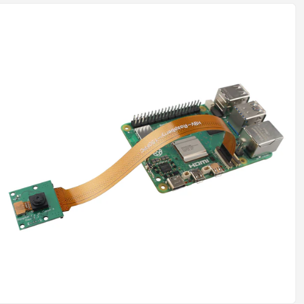

# qubit-note: RaspeberryPi Series | Use Raspberry Pi Camera Module


## Overview

A camera is one of the most powerful sensors we can have on our robot. In this note, I will show you how to
use the camera on a Raspeberry Pi 5 board. 

**keywords** Programming, Raspberry-pi, Embedded-systems, Sensors, Pi-camera

## Use Raspberry Pi Camera Module

For this note we will be using a Raspeberry Pi 5 board and an OV5647 camera sensor.
Specifically, we will be using the <a href="https://www.zde.plus/products/zde-5mp-1080p-mini-camera-module-webcam-video-camera-module-support-ov5647-sensor-compatible-with-raspberry-pi-5-4b-3b-3b-2b-zero-w-2w">ZDE 5MP 1080p Mini Camera Module</a>
The Raspberry Pi 5 board has two camera slots. Connect the camera at camera 1 slot (the one closest to the HDMI ports on the board).
Notice also that the coloured part of the ribbon cable should also look towards the HDMI ports of the board. See the image below

|                     |
|:---------------------------------------------------------------:|
|  **Figure: Camera connection on Raspberry Pi 5. Image from [1]**|

We will connect to the board using ssh i.e. headless mode. Therefore we want be able to open any review windows.
We will write however a small Python script that captures an image using the attached camera.

Use

```
rpicam-hello
```

to verify that your camera is identified. You should see something like the following

```
[0:01:28.835180512] [1790]  INFO Camera camera_manager.cpp:340 libcamera v0.6.0+rpt20251202
[0:01:28.843344796] [1793]  INFO RPI pisp.cpp:720 libpisp version 1.3.0
[0:01:28.845995430] [1793]  INFO IPAProxy ipa_proxy.cpp:180 Using tuning file /usr/share/libcamera/ipa/rpi/pisp/ov5647.json
[0:01:28.852772394] [1793]  INFO Camera camera_manager.cpp:223 Adding camera '/base/axi/pcie@1000120000/rp1/i2c@80000/ov5647@36' for pipeline handler rpi/pisp
[0:01:28.852809229] [1793]  INFO RPI pisp.cpp:1181 Registered camera /base/axi/pcie@1000120000/rp1/i2c@80000/ov5647@36 to CFE device /dev/media0 and ISP device /dev/media2 using PiSP variant BCM2712_C0
Made X/EGL preview window
Made DRM preview window
Preview window unavailable
Mode selection for 1296:972:12:P
    SGBRG10_CSI2P,640x480/0 - Score: 3296
    SGBRG10_CSI2P,1296x972/0 - Score: 1000
    SGBRG10_CSI2P,1920x1080/0 - Score: 1349.67
    SGBRG10_CSI2P,2592x1944/0 - Score: 1567
Stream configuration adjusted
[0:01:29.323936194] [1790]  INFO Camera camera.cpp:1215 configuring streams: (0) 1296x972-YUV420/sYCC (1) 1296x972-GBRG_PISP_COMP1/RAW
[0:01:29.324059256] [1793]  INFO RPI pisp.cpp:1485 Sensor: /base/axi/pcie@1000120000/rp1/i2c@80000/ov5647@36 - Selected sensor format: 1296x972-SGBRG10_1X10/RAW - Selected CFE format: 1296x972-PC1g/RAW
#10 (0.00 fps) exp 33239.00 ag 8.00 dg 1.00
#11 (30.00 fps) exp 33239.00 ag 8.00 dg 1.00
#12 (30.00 fps) exp 33239.00 ag 8.00 dg 1.00

```

----
**Remark**

On Raspberry Pi 5 instead of ```libcamera-hello``` we should use ```rpicam-hello```.

----

Next, let's write a script that captures an image. Install PiCamera and OpenCV for Python on the board

```
sudo apt install python3-opencv
sudo apt install python3-picamera2

```

Next use the following script to capture an image from the camera:

```
from picamera2 import Picamera2
import cv2

picam2 = Picamera2()
picam2.configure(
    picam2.create_still_configuration(
        main={"format": "RGB888", "size": (640, 480)}
    )
)
picam2.start()

frame = picam2.capture_array()

# Save image instead of showing it
cv2.imwrite("frame.jpg", frame)

print("Saved frame.jpg")

```

On the host machine use

```
scp <user-name>@<pi-ip>:/path/on/pi/where-is/frame.jpg .
```

To copy the image across.

## Summary

This qubit-note explains how to set up and use a camera on a Raspberry Pi 5 in headless (SSH) mode. It describes connecting an OV5647-based camera module to the correct CSI port and orientation on the Pi 5, verifying detection using ```rpicam-hello```. 

## References

1. <a href="https://www.zde.plus/products/zde-5mp-1080p-mini-camera-module-webcam-video-camera-module-support-ov5647-sensor-compatible-with-raspberry-pi-5-4b-3b-3b-2b-zero-w-2w">ZDE 5MP 1080p Mini Camera Module</a>