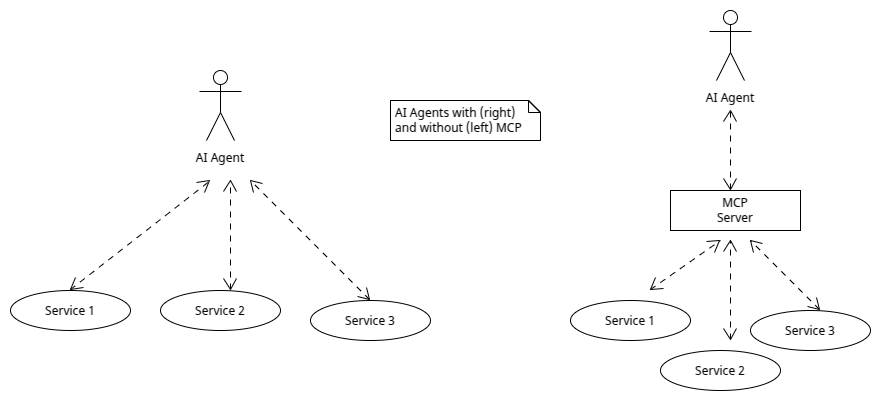

# qubit-note: AI Series | Model Context Protocol

In this note, I give a high level overview of the <a href="https://www.anthropic.com/news/model-context-protocol">model context protocol</a> paradigm or MCP
for short. Then I would like to cover the MCP architecture from a rather hight level perspective.

**keywords** model-context-protocol, MCP, AI-agents, large-language-models, AI-engineering

## Model Context Protocol

Let' frist try to understand what MCP really is. The MCP standard was introduced by <a href="https://www.anthropic.com/">ANTHROPIC</a>
in November 2024. The standard allows AI agents (e.g. LLMs) to connect to various tools, data sources and repositories that they
might need in order to execute their task. The MCP standard aims at hidding the complexity that is needed in order to have an agent being able to have 
access to a specific data source. Indeed, according to ANTHROPIC:

_... It provides a universal, open standard for connecting AI systems with data sources, replacing fragmented integrations with a single protocol. 
The result is a simpler, more reliable way to give AI systems access to the data they need._

The following figure illustrates the idea behind MCP.

|   |
|:-----------------------------------------------------------:|
|             **Figure 1: MCP schematics**                    |

The idea is akin to the <a href="https://microservices.io/patterns/apigateway.html">API Gateway pattern</a> from the client perspecitve.

So how this whole thing works then? The idea is rather simple, which is what makes it really great;
AI engineers can either expose their resources using an MCP server or can develop AI agents (or according to the article above MCP clients)
that connect to these MCP servers. 

One thing one must appreciate is that MCP does not add anything new in an agent per ce but rather allows to more easilly integrate
functionality that our agent may require.

### MCP Architecture

Now that we have an understanding what MCP is let's turn into the architecture of the protocol.
First you should note that MCP follows a <a href="https://en.wikipedia.org/wiki/Client%E2%80%93server_model">client-server architecture paradigm</a>.
However, each server focuses on a specific domain e.g. seraching over the internet or various database operations. in addition, it includes the following actors:

- MCP client
- MCP host
- MCP server

As mentioned above, an  MCP server exposes specific actions, perhaps around one domain, that an MCP client can access.
Servers can run  either on the same machine as the MCP host or remotely. MCP is designed to support both scenarios seamlessly. 
An MCP server will advertise what it can do in a standard format. The MCP client can query and understand  tools available on an MCP servet.
An MCP client is hosted by an MCP host and it handles  the low-level communication details with an MCP Server. Note that the MCP client can connect to multiple MCP servers.

The video: <a href="https://www.youtube.com/watch?v=7j1t3UZA1TY">MCP vs API: Simplifying AI Agent Integration with External Data</a>
discussess the differences between MCP and a REST API. The video: <a href="https://www.youtube.com/watch?v=nPGXlIorZbg">Add Authorization to MCP Servers with WorkOS Roles & Permissions</a>
discusses how to add authorization and authentication for MCP servers.

<a href="../how_to/2025-08-27-build-local-mcp-server-and-client.md">qubit-note: AI Series | Build an MCP Server Part 1</a> shows how to build and  run an MCP server locally.

## Summary

This note provides a high-level overview of the Model Context Protocol (MCP), introduced by Anthropic in November 2024, which serves as an open standard for connecting AI agents, such as large language models, to diverse tools, data sources, and repositories. MCP simplifies integration by replacing fragmented connections with a universal protocol, enabling agents to access the resources they need without added complexity. Following a client-server architecture, MCP includes three main components: the MCP client, MCP host, and MCP server, with servers often focused on specific domains like internet search or database operations. While MCP does not enhance an agent’s inherent capabilities, it streamlines their ability to integrate and utilize external functionality, akin to an API gateway from the client perspective.

<a href="../how_to/2025-08-27-build-local-mcp-server-and-client.md">qubit-note: Build a Local MCP Server & Client</a> shows how to use <a href="https://gofastmcp.com/getting-started/welcome">FastMCP</a> and <a href="https://github.com/mcp-use/mcp-use">mcp-use</a> to create an MCP server and an MCP client.

## References

1. <a href="https://www.anthropic.com/news/model-context-protocol">model context protocol</a>
2. <a href="https://microservices.io/patterns/apigateway.html">API Gateway pattern</a>
2. <a href="https://www.youtube.com/watch?v=5xqFjh56AwM">MCP Crash Course for Python Developers</a>
