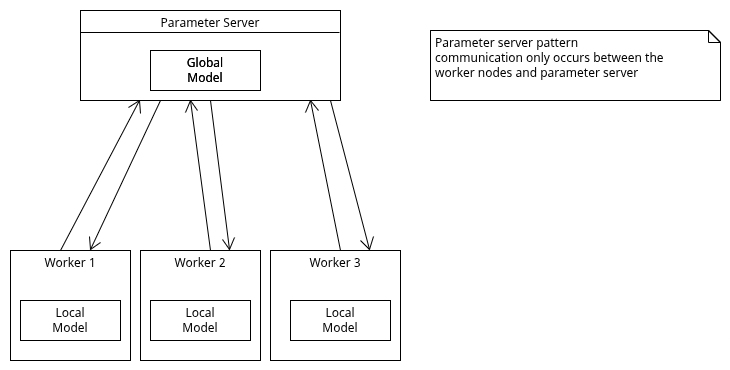

# qubit-note: Training Patterns for Distributed ML

## Overview

<a href="2025-05-07-dataingestion-patterns-for-dist-ml.md">qubit-note: Data Ingestion Patterns for Distributed ML</a>
introduces three core patterns for ingesting data into a distributed ML model training workflow.
One of the patterns, namely sharding, assumed the existence of multiple worker nodes that each of these
workers trains a copy of the model on a specific shard. These trained copies somehow need to be
reconciled in order to have one global model.

In this note, I discuss some patterns that we can use to reconcile the local copies
of the models to a global one. Namely, I discuss

- Parameter server pattern
- Collective communincation pattern

**keywords** machine-learning, distributed-machine-learning, distributed-ml-training

## Training patterns for distributed ML

ML models frequently are large enough to fit the whole model in one machine. Thus we need to
break the model into smaller pieces and train each of these submodels on different machines.
This is the essence of distributed training. Thus, distributed model training most often happens in a cluster
of machines. Typically these machines will be able to communicate with
each other over the network.


### Parameter server pattern

The first pattern I am going to discuss is the parameter server pattern. Consider the scenario, where we are dealing
with a large dataset that we cannot fit on a single machine. We can of course use the batching
pattern and on a single machine fetching batches of the dataset and feed to the model. Since we cannot store
this dataset locally, it is understandable that this process will be quite time consuming.

Alternatively, we can use the sharding pattern and partition the dataset into a number of shards that we feed
into different machines. We can now train local copies of a model on individual shards but how do we bring these local
copies into one model?

The parameter server pattern solves this problem. In this pattern, each worker node sends the calculated gradients to
a dedicated server, called the parameter server, to update the  model parameters [1]. 
The worker nodes do not have to communicate with each other. This is shown schematically in the figure below.

|   |
|:------------------------------------------------------------------------:|
|             **Figure 1: Parameter server pattern**                       |


The parameter server pattern presented above assumes that the model can fit in a single machine.
This however this need not be the case. When the model does not fit in a single machine, 
we can use additional parameter servers, that each new parameter server is responsible 
for storing and updating a particular model partition. 

### Collective communication pattern

Although the parameter server pattern can be used for cases where the model is large to fit in 
a single machine, it may be difficult to do so as the numbers of workers and parameter servers increase.
This is because the cost of communication among the workers and parameter servers is becoming significant.
This is particularly the case when multiple workers send gradient updates to one parameter server.


Collective communication involves communication across all particiapating
processes in a group, if you ever used MPI this is your ```MPI_COMM_WORLD``` variable.
In such a scenario, all particiapting workers communicate their gradients to each other.  
In fact, we typically perform some sort of aggregation, e.g maximum, minimum, summmation, on all the gradients received and this aggregated result
is what is communicated.


Collective communication can done in $O(2(N-1))$ using the _ring-allreduce_ algorithm.

## References

1. Yuan Tang, _Distributed Machine Learning Patterns_, Manning Publications, 2024.
2. <a href="https://web.eecs.umich.edu/~mosharaf/Readings/Parameter-Server.pdf">Scaling Distributed Machine Learning with the Parameter Server</a>