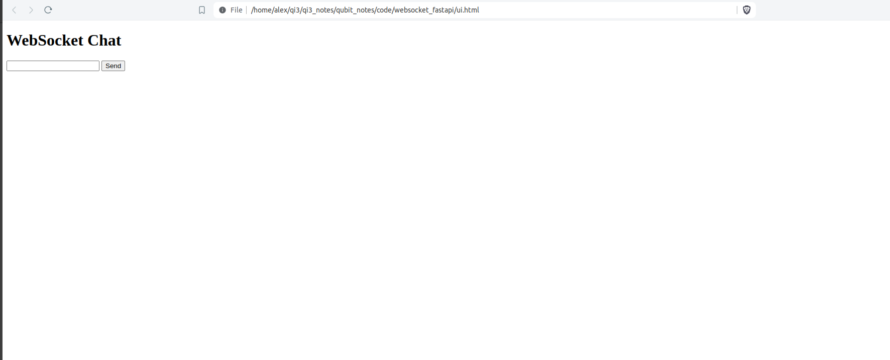

# WebSocket with FastAPi

FastAPI is a powerful Python framework for web development and in particular REST APIs.
Most REST APIs use the HTTP/HTTPs protocol in order to communicate with the client.
When using HTTP the client has to initiate the communcation with the server.
However, this may not always be desirable. For example consider a chat application. 
In this case the serve will have to poll the server every second or so in order to check
if there is a new message. Certainly, this is not very conventient whilst it is
resource consuming. It would have been very convenitient if we could establish
a two way communication between the client and the server in such situations.

The WebSocket protocol can be used in such cases. This is a comunication protocol that  provides simultaneous two-way communication channel over a single TCP connection [1]. 
HTTP and WebSocket are different protocols. However, the latter has been designed to be compatible with the former.
When opening a WebSocket connection, this is firt initiated using an HTTP request and then upgraded to a WebSocket tunnel.
In addition, WebSockets are identified through classic URIs with a host, path and query parameters similar to HTTP.
If you need more technical information about the WebSocket technology you can check the wikipedia article in [1] and the resources therein.

In this article we will discuss how to develop a simple application using WebSockets with FastAPI. 
The official documentation can be found in [2].


## Create a WebSocket with FastAPI

FastAPI provides a special _websocket_ decorator that we can use in order to create a WebSocket.
The following code snippet shows how to create a simple WebSocket with FastAPI

```python
from fastapi import FastAPI, WebSocket
from starlette.websockets import WebSocketDisconnect


websocket_app = FastAPI()

 
@websocket_app.websockey("/ws")
async def ws_chat(websocket: WebSocket):
    await websocket.accept()
    try:
        while True:
            msg = await websocket.receive_text()
            await websocket.send_text(f"Your text was: {msg}")
    except WebSocketDisconnect:
        pass
```

Let's try to run this code. Start the ```uvicorn``` server using the command below

```bash
uvicorn websocket_app:websocket_app --port=8001 --host='0.0.0.0' --reload
```

Put the following HTML code in a file called ```ui.html```

```
<!DOCTYPE html>
<html>
    <head>
        <title>Chat</title>
    </head>
    <body>
        <h1>WebSocket Chat</h1>
        <form action="" onsubmit="sendMessage(event)">
            <input type="text" id="messageText" autocomplete="off"/>
            <button>Send</button>
        </form>
        <ul id='messages'>
        </ul>
        <script>
            var ws = new WebSocket("ws://localhost:8001/ws");
            ws.onmessage = function(event) {
                var messages = document.getElementById('messages')
                var message = document.createElement('li')
                var content = document.createTextNode(event.data)
                message.appendChild(content)
                messages.appendChild(message)
            };
            function sendMessage(event) {
                var input = document.getElementById("messageText")
                ws.send(input.value)
                input.value = ''
                event.preventDefault()
            }
        </script>
    </body>
</html>
```

Open the file with your browser. You should be able to view 

|  |
|:--:|
| **Figure: Simple chat UI.**|

Navigate to http://0.0.0.0:8001/docs

## References

1. <a href="https://en.wikipedia.org/wiki/WebSocket">WebSocket</a>
2. <a href="https://fastapi.tiangolo.com/advanced/websockets/">WebSockets</a>
