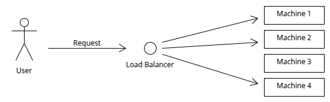

# Note: Load Balancing

## Overview

In this note I will go over <a href="https://en.wikipedia.org/wiki/Load_balancing_(computing)">load balancing</a> approaches. Modern systems  have to 
deal with heavy load/traffic. This poses the need to distribute this work over a number
of workers. A load balancer effectively partions in one way or another the incoming traffic
so that we do not overload one machine. 

We can implement load balancing in various places in our systemLaod balancers can be used in various places in our system. Furthermore, we can have static or dynamic load balancing 
and statefull or stateless.

**keywords** software-architecture, system-design, distributed-systems, load-balance

# Load balancing

Modern day datacenters have typically to serve millions of requests per day. These requests are processed
by the machines that constitute the datacenter. You can understand that given the volume of the requests and the
the amount of computation and/or the volume of the data that is needed to be transferred in order to serve the incomping requests, sending all in one machine or
just a few machines will not work. We need therefore ways to spread the load amongst the available machines.
This is where load balancers step in. In general, load balancers allow us to improve or maintain the following
general aspects of our application: 

- Scalability
- Availability
- Performance

The folloinw figure shows schematically the job of a load balancer.

|     |
|:---------------------------------------------------------:|
|      **Figure 1: Schematics of load balancing.**          |

It is rather obvious why a load balancer can imporve the overall performance of our system.
However, a load balancer can also provide several key services such as:

- Security: Given that we now place a LB in front of our servers, we now have the opportunity to mitigate attacks such as <a href="https://en.wikipedia.org/wiki/Denial-of-service_attack">denial of service</a>.
- Health checking:  A load balancer needs to know which servers are available in order to send a request. Thus an LB allows us to monitor the health of our servers.

Typically, we will place a load balancer between the client and the available servers.
However, this need not be the case; for example we can place a load balancer between the application servers and the 
servers that host the database and/or  between our web servers and the application servers

Now that we have  a conceptual understanding what a load balancer does, let's briefly discuss how a load balancer distributes
the load. This is done using various algorithms various <a href="https://kemptechnologies.com/load-balancer/load-balancing-algorithms-techniques">load balacing algorithms</a>:

- Round-robin scheduling
- Weighted round-robin
- Least connections
- URL hash

I won't go over the details of these algorithms. You can check the references provided, e.g. reference [4].
I do want to mention that in general we have staic and dynamic load balancing algorithms.
Usually, a static algorithm will not consider the changing state of the servers. Their major advantage is their simplicity.
In contrast, a dynamic algorithm will consider the state of the servers. These  algorithms maintain state and thet do so by communicating with the server.
These algorithms therefore can potentially increase commnucation overhead but it results in improved forwarding decisions.

## References

1. <a href="https://en.wikipedia.org/wiki/Load_balancing_(computing)">Load balancing</a>
2. <a href="https://aws.amazon.com/what-is/load-balancing/">What is load balancing?</a>
3. <a href="https://cloud.google.com/load-balancing">Cloud load balancing</a>
4. <a href="https://kemptechnologies.com/load-balancer/load-balancing-algorithms-techniques">Load balacing algorithms</a>
