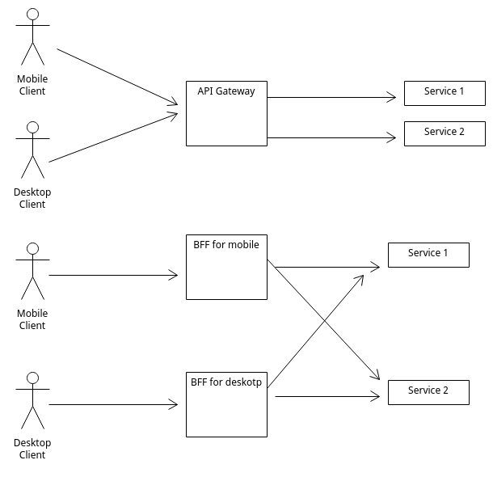

# qubit-note: Backend-for-frontend Pattern

## Overview

In this short note, I will go over the so called <a href="https://learn.microsoft.com/en-us/azure/architecture/patterns/backends-for-frontends">backend-for-frontend pattern</a> or BFF.

The microservice architecture  is a well established architectural pattern for modern day software. 
This pattern poses some core advantages over  software monoliths such as scaling and deploying independently.

One problem that arises when we use microservices is the fact that often the client, e.g a web browser, needs to make 
multiple calls to perhaps multiple services in order to create the corresponding view. This has
two main disadvantages:

- Increase the latency needed to load a view (and consequently reduce the user experience)
- Forces the client to be aware of the various services that it needs to call (this can cause serious problems when we think software maintainance)

The <a href="https://learn.microsoft.com/en-us/azure/architecture/patterns/backends-for-frontends">backend-for-frontend pattern</a> 
is a pattern that we can utilise to reduce the number of service calls the client has to undertake.

**keywords** system-design, software-architecture, software-patterns, microservices

## Backend-for-frontend pattern

One of the problem that surfaces when working with microservices is that often in order for a client to fulfill its mission it needs
to make a number of API calls. This of course increases the latency and diminishes the user experience. 

One architecture pattern we can employ in order to solve such a problem is the <a href="https://learn.microsoft.com/en-us/azure/architecture/patterns/backends-for-frontends">backend-for-frontend pattern</a>. In this pattern, the client communicates with a service that it is responsible for aggregating the responses of the needed API calls.
This approach has several advantages such as cutting down the number of requests the client has to do on our servers.
Instead of customizing the backend for the various clients, we use a third service to manipulate the needed data for every client.
Additionally, we can  embed logic related to failovers and/or
retries inside of this service.

This may sound like the <a href="https://microservices.io/patterns/apigateway.html"API Gateway pattern</a> and indeed it is as the backend-for-frontend is a kind
of an API Gateway pattern. But there are a few differences. This is best explained using the digrams below.

bff-vs-api-gateway.png

|         |
|:-----------------------------------------------------------:|
|             **Figure 1: BFF vs API Gateway patterns**       |

So the API Gateway represents a single point of enrty into the system. This is regardless of the type of the client.
In contrast, as I have already mentioned, the backend-for-frontend pattern represents an entry point suitable for a particular type of client.

So the next obvious question is when to use BFF over API Gateway? Obviously, when we do not want to support multiple client types, we can use
the latter as there is no need to use the former. However, when this is not the case we need to start thinking
how different the different client types we want to support are. Questions like the communication
protocols used e.g. REST vs GraphQL or authentication approaches used  can help towards making a decision.

## References

1. <a href="https://samnewman.io/patterns/architectural/bff/">Pattern: Backends For Frontends</a>	
1. <a href="https://learn.microsoft.com/en-us/azure/architecture/patterns/backends-for-frontends">Backends for Frontends pattern</a>
2. <a href="https://medium.com/@platform.engineers/api-gateway-and-backends-for-frontends-bff-patterns-a-technical-overview-8d2b7e8a0617">API Gateway and Backends for Frontends (BFF) Patterns: A Technical Overview</a>
