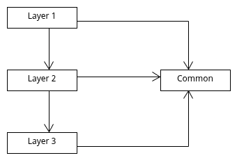

# qubit-note: Architecture Patterns-Layers Pattern

## Overview

In this quibit note, I discuss the layered architecture pattern. This is perhaps the  most common architecture pattern also known as the n-tier architecture pattern [1]. 
Overall, the pattern is easy to conceptualize; application code is partitioned into distinct and somehow independent layers.
Often, we allow modules in higher levels to use functionality from modules in lower levels or even just the level below.

**keywords** software-architecture, architecture-patterns, system-design

## The layers pattern

The layers pattern organises code into distinct layers or modules. Typically, this organisation should promote cohesion
and decreased coupling. It also allows the developers to better collaborate [2]. These attributes of course increase 
software maintainability. Below are the main components of this pattern

**Elements**

The layers pattern has only only one element; the layer which represents a group of functionally cohesive modules [2].

**Relations**

In order to employ the layers pattern we need to establish the relations amongst the particiapting layers i.e. which layers may use modules
within another layer

**Rules for use**

In the layers pattern every module must exist in only one layer. 
Typically, that layers above in the hierarchy are allowed to use the layers below.
However, not vice-versa The allowed to use relation can be more restrictive so that the current layer may only use the layer immediately below it. Cyclical dependencies are not permitted [2].

**Strengths**

As I have already mentioned, this pattern favours maintainability, and portability, as well as reusability and testability.

**Weaknesses**

The layers pattern attempts to compartmentalise application code into distinct and cohesive groups.
Each group/layer may  interact with another layer using abstractions. When moving top to bottom, this
can increase complexity and overall harm the perfromance of the system [2].

The following image graphically demonstrates the layeres pattern

|  |
|:---------------------------------------------------:|
|          **Figure: Layers pattern.**                |

One of the problems that arises with such an arrangement is how we handle the functionality that all layers share i.e. the _common_ group. Approaches could be
to use a shared library for each layer that we version appropriately. 

## Summary

In this quibit-note, I reviewed the layers architecture pattern. Conceptually, this is one of the simplest patterns to implement.
It has several advantages however it may hurt performance particularly as the number of layers increases.

## References

1. Mark Richards, _Software Architecture Patterns_,  O'Reilly.
2. Michael Keeling, _Design It! From programmer to software architecture_, The Pragmatic Programmers.